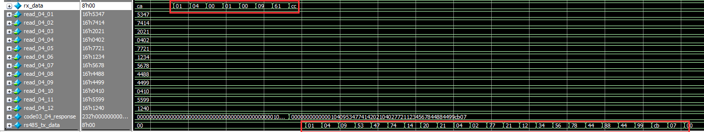
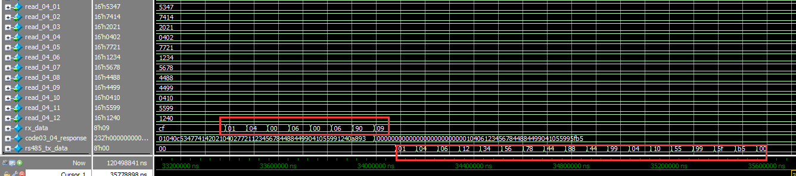
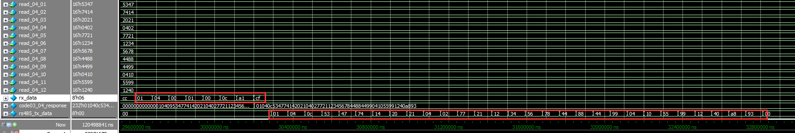
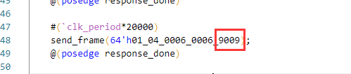
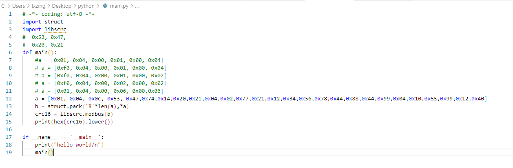

由于项目需求，需要将modbus和AXI_Lite接口结合

即modbus的相应寄存器适配到AXI Lite接口上，ps端可以读写03，04寄存器

其中：

    03，读channel（共4个channel,即四个数据源）

    04，各个channel的参数，分辨率（宽，高），帧数，共需12个reg寄存

    返回响应，5个固定字节，1字节addr+1字节功能码+1字节数据长度+ data(最大为12 * 2bytes) + 2字节crc

    06，写channel，选择哪一个数据源

    03，06功能码接收和响应逻辑不做改变

## 仿真测试

首先，代码中的数据位宽和逻辑需做相应修改，可参考源码

如图所示仿真图，将04寄存器个数扩展为12个，从01开始对9个

从06开始读6个

  从01开始读12个

从仿真结果，test is ok

注意，在testbeench中若是改变命令码，则crc校验部分一定要变化

可通过运行python代码进行计数

已封装成IP,未结合Vitis进行测试
