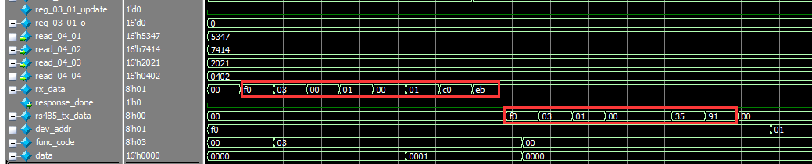
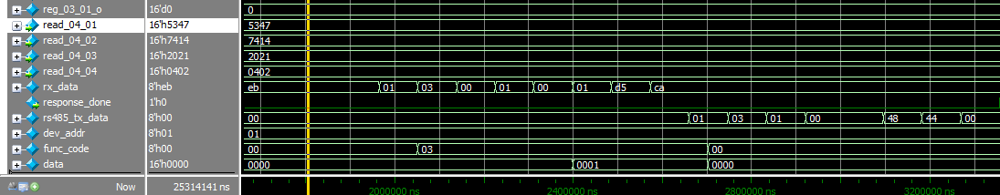
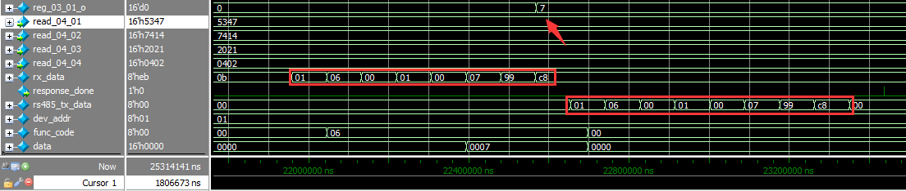
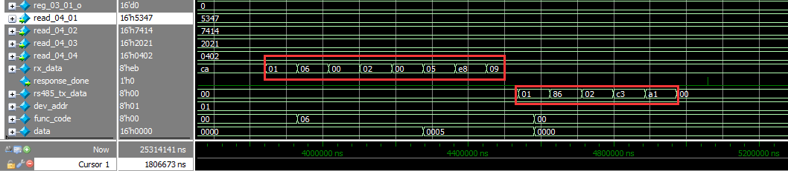
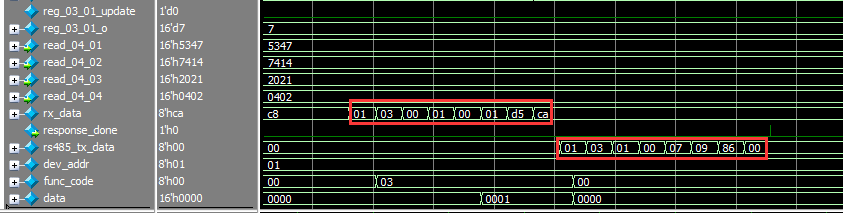
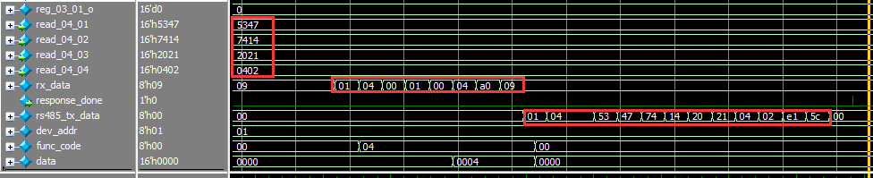
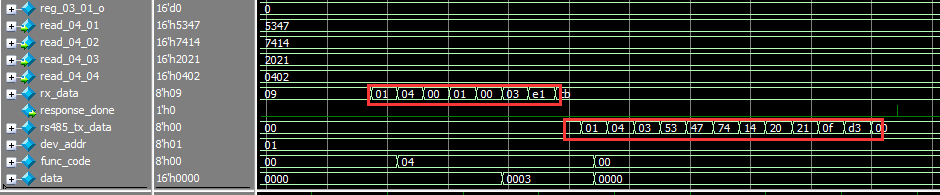
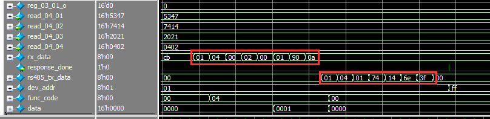
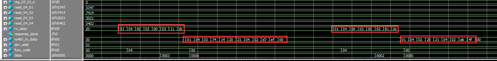
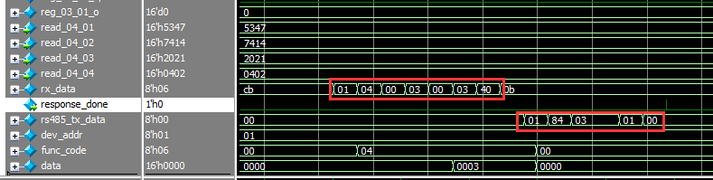

# modbus_crc_verilog

slave ID 通过 port 设置

# Modbus RTU Slave Pure RTL design for FPGA

design a ip implements Modbus RTU slave sub function 03 04 06 on FPGA.

Function code: 03 04 06

Exception code: 01 02 03 04

Function 03: ligal reg 0001, ligal quantiy 0001

Function 04: ligal reg 0001~0004, ligal quantiy + ligal reg < 0005

Function 06: ligal reg 0001, ligal data 0000~0017, coresponding to Function 03 reg 0001

## uart tx and uart rx

done

uart_byte_tx_tb.do

uart_byte_rx_tb.do

## rx 3.5T and 1.5T interval detect

done

ct_35t_gen_tb.do

ct_15t_gen_tb.do

## rx slave address and frame check

done

frame_rx_tb.do

## checksum if slave address check pass

done

modbus_crc_tb.do

## Exception handling (exclude 04)

### checksum mismatch then do nothing

### illegal fuction code retrun 01

### illegal address return 02

### illegal quantity return 03

done

exceptions_tb.do

# read / write func logic

done

func_handler_tb.do

# simulation

### 03 test

截图中，rx_data为RS 485总线接收到的一帧命令，rs485_tx_data为从机发送给主机响应的数据

其中：

    dev_addr为从机设备地址

    func_code为功能码，目前支持03，04，06功能码

    data为传输数据的长度，即指示发送和接收数据的个数

03功能测试指令中可看出发送格式为：dev_addr + func_code(03) + reg_addr(2 bytes,也读取寄存器地址) + data_leng(2 bytes,也即读取的数据个数 + crc16(2 bytes)

正确返回的响应数据格式为：dev_addr + func_code(03) + data_length(数据个数) +  data(2 bytes，为03寄存器读出值) + crc16(2 bytes)

更换设备ID为01再次测试，无误

03 test is ok

### 06 tets

06功能测试指令中可看出发送格式为：dev_addr + func_code(06) + reg_addr(2 bytes,也即写入寄存器地址) + data(2 bytes，写入reg_03_01_o寄存器数据) + crc16(2 bytes)

正确返回的响应数据格式为：dev_addr + func_code(06) + reg_addr(2 bytes,也即写入寄存器地址) + data(2 bytes，写入reg_03_01_o寄存器数据) + crc16(2 bytes)

可看出reg_03_01_o寄存器在接收到正确的06功能码后数据有更新

错误的06帧格式，如下reg_addr为02，但03与06操作的寄存器只有一个reg_03_01_o（03读，06写），故返回异常指令

返回的exception格式：dev_addr + 80 | func_code(如下图即为86) + exception return code (如下图illegal address return 02) + crc16(2 bytes)

06写入成功后，用03读取进行测试一下

test is ok

### 04 test

04 功能为只读寄存器数据，代码中只设置了4个寄存器，分别是read_04_01,read_04_02,read_04_03,read_04_04

04功能测试指令中可看出发送格式为：dev_addr + func_code(04) + reg_addr(2 bytes,也读取寄存器地址) + data_leng(2 bytes,也即读取的数据个数 + crc16(2 bytes)

正确返回的响应数据格式为：dev_addr + func_code(04) + data_length(数据个数) +  data(寄存器读出值，此时byte数为data_leng*2) + crc16(2 bytes)

从仿真图可知，在04功能码下，从第一个地址处开始即read_04_01，读取4个寄存器的值

从仿真图可知，在04功能码下，从第一个地址处开始即read_04_01，读取3个寄存器的值

从仿真图可知，在04功能码下，从第二个地址处开始即read_04_02，读取1个寄存器的值

从仿真图可知，在04功能码下，两段命令分为从第二个地址处开始即read_04_02，读取3个寄存器的值；从第三个地址处开始即read_04_03，读取2个寄存器的值

04 功能码下的异常，读取数据个数不对，illegal quantity return 03

经仿真与分析，04 test is ok

# top wrapper {  }

done

modbus_rtu_slave_top_tb.do

# test on board

经过仿真与上板测试，无误
程序中代码仍有部分可优化
